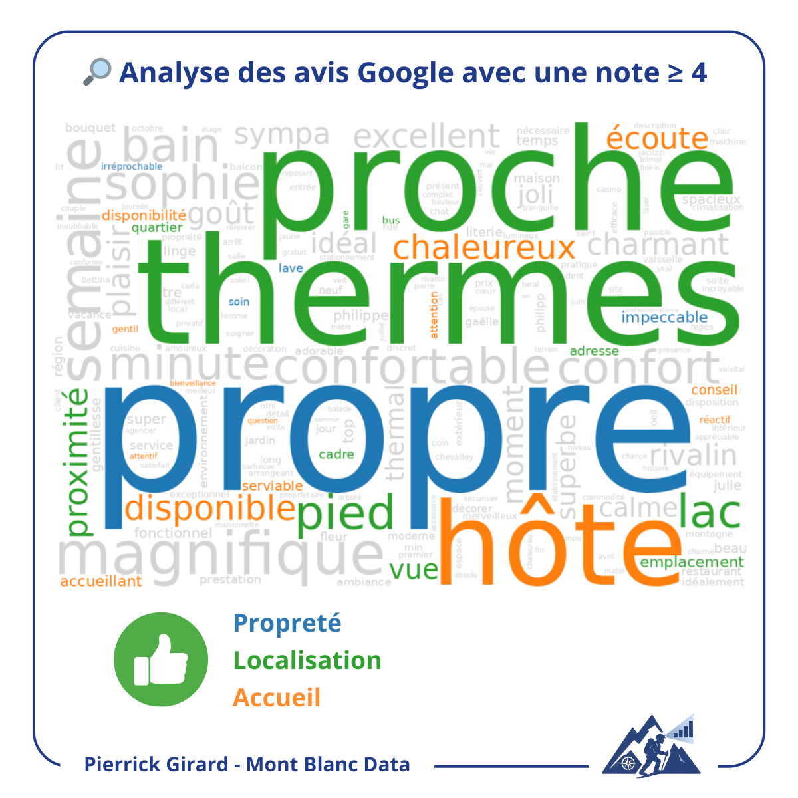
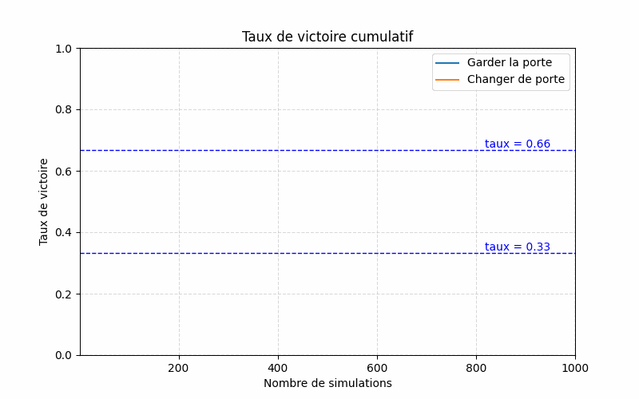
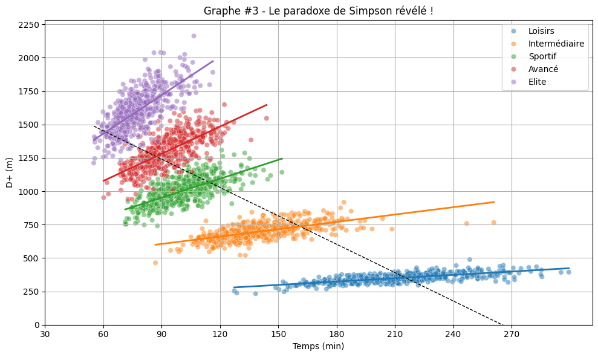
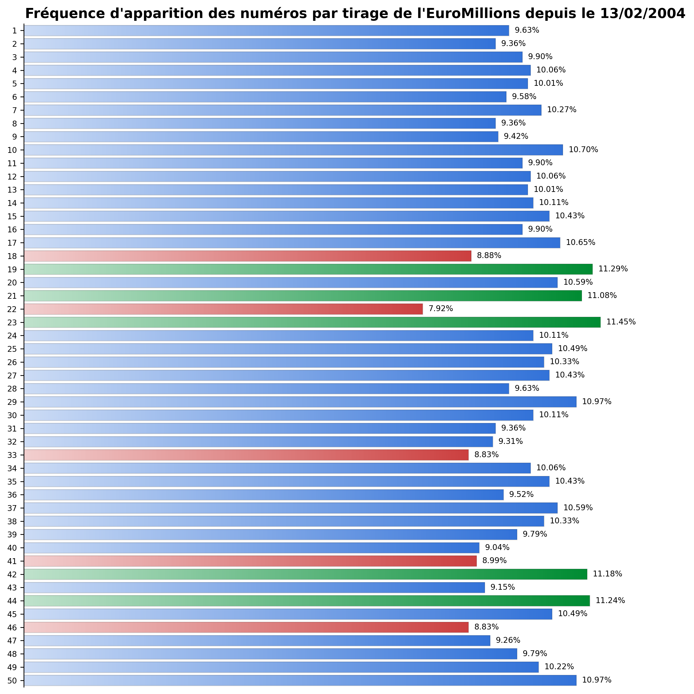

Spécialiste de la <b>valorisation des données</b>, j’aide les organisations à transformer leurs enjeux métiers en <b>insights clairs, stratégiques et actionnables</b>.  
Mon expertise couvre <b>SQL</b>, <b>Python</b> et <b>Power BI</b>, que je mets au service de la création de <b>dashboards intuitifs</b>, de <b>pipelines robustes</b> et de stratégies data <b>orientées résultats</b>.  
Passionné de montagne, j’ai fondé <b>Mont Blanc Data</b> : un nom choisi avec soin, car je souhaite être pour mes clients un guide de leurs données. Comme en haute montagne, mon rôle est de tracer la voie, sécuriser le chemin et rendre le sommet - vos objectifs - atteignable grâce à une <b>exploitation intelligente</b> de vos données.  
Au-delà de la technique, je suis convaincu que <b>la donnée doit parler à tous</b>. J’aime raconter les histoires qu’elle porte, vulgariser des concepts complexes et concevoir des analyses <b>visuelles et inspirantes</b> qui permettent à chacun – décideur ou passionné – de s’en emparer.  
Déjà opérationnel sur des approches en <b>intelligence artificielle</b> et <b>traitement du langage</b>, je continue à explorer les dernières avancées de la <b>data science</b> pour enrichir mes missions.  
Mon objectif reste inchangé : <b>rendre la donnée claire, accessible et porteuse de valeur.  

---

### Analyse des avis Google pour les hébergements d'Aix-les-Bains

<dl class="meta">
  <dt>Contexte</dt>
  <dd>Étude des avis Google pour identifier les <b>atouts</b> et irritants de l’hébergement touristique à Aix-les-Bains, afin de transformer la voix des clients en leviers d’action.</dd>
  <dt>Détails techniques</dt>
  <dd>Collecte via <b>API Google</b> & <b>SerpAPI</b>, pipeline <b>NLP</b> (spaCy, lexiques, clustering KMeans), visualisations (bar charts, wordclouds) pour dégager les thèmes saillants.</dd>
  <dt>Compétences clés</dt>
  <dd><b>Scraping</b>, NLP appliqué en français, <b>clusterisation</b> (KMeans), visualisation avancée, <b>storytelling</b> analytique.</dd>
  <dt>Réutilisation client</dt>
  <dd>Baromètre <b>e-réputation</b>, suivi de la satisfaction et des irritants, appui aux offices de tourisme et extension multi-plateformes (Booking, Airbnb).</dd>
</dl>

 

    

[Voir le code sur GitHub](https://github.com/montblancdata/aix-reviews-scrapping)  
[Voir le post LinkedIn — Scraping](https://www.linkedin.com/posts/activity-7366718688252616704-XJmO?utm_source=share&utm_medium=member_desktop&rcm=ACoAACzgxhYBcSNWmmZ2vAaHo3MYaYV_Oq1uukA)  
[Voir le post LinkedIn — NLP](https://www.linkedin.com/posts/activity-7369255404532387840-gaxW?utm_source=share&utm_medium=member_desktop&rcm=ACoAACzgxhYBcSNWmmZ2vAaHo3MYaYV_Oq1uukA) 

---

### Simulation du problème de Monty Hall

<dl class="meta">
  <dt>Contexte</dt>
  <dd>Célèbre paradoxe de <b>probabilité</b> où un choix apparemment aléatoire ne l'est pas. Le projet illustre comment la <b>data</b> valide ou corrige nos intuitions.</dd>
  <dt>Détails techniques</dt>
  <dd>Script <b>Python</b> simulant des milliers de parties, calcul des taux cumulés de victoire (garder vs changer) et génération d’un <b>GIF animé</b> montrant la convergence vers les probabilités réelles.</dd>
  <dt>Compétences clés</dt>
  <dd><b>Simulation aléatoire</b>, pandas & numpy, <b>animation</b> matplotlib, pédagogie statistique.</dd>
  <dt>Réutilisation client</dt>
  <dd>Démos pédagogiques pour vulgariser la <b>probabilité</b> et l’incertitude, illustrations interactives pour la formation ou la communication data.</dd>
</dl>

    

[Voir le code sur GitHub](https://github.com/montblancdata/montyhall-simulation) • [Voir le post LinkedIn](#)

---

### Illustration du paradoxe de Simpson

<dl class="meta">
  <dt>Contexte</dt>
  <dd>Simulation réaliste de données de randonnée pour un territoire de montagne afin d’illustrer un <b>paradoxe statistique</b> : des tendances inversées apparaissent entre analyse globale et segmentation par profils de randonneurs.</dd>
  <dt>Détails techniques</dt>
  <dd>Génération de données cohérentes (temps, D+, distance, profils), filtrage et garde-fous, visualisations avec <b>régressions linéaires</b> globales vs sous-groupes. Librairies : <b>numpy</b>, <b>pandas</b>, <b>scikit-learn</b>.</dd>
  <dt>Compétences clés</dt>
  <dd>Simulation de données, <b>régression</b>, visualisation avancée, détection de variables de confusion, <b>data storytelling</b> pédagogique.</dd>
  <dt>Réutilisation client</dt>
  <dd>Fiabilisation d’<b>A/B tests</b>, meilleure lecture des KPIs agrégés, mise en évidence d’effets de confusion pour éviter des décisions erronées.</dd>
</dl>

    

[Voir le code sur GitHub](https://github.com/montblancdata/simpson-paradox) • [Voir le post LinkedIn](https://www.linkedin.com/posts/activity-7320691670239326208-I3ug?utm_source=share&utm_medium=member_desktop&rcm=ACoAACzgxhYBcSNWmmZ2vAaHo3MYaYV_Oq1uukA)

---

### EuroMillions — Pipeline de nettoyage & dataviz

<dl class="meta">
  <dt>Contexte</dt>
  <dd>À partir d’un fait d’actualité (jackpot record), analyse des tirages historiques pour montrer comment <b>structurer</b> et valoriser des données publiques.</dd>
  <dt>Détails techniques</dt>
  <dd>Mise en place d’une chaîne raw → silver → gold (zip, CSV, <b>pandas</b>), <b>nettoyage</b> avancé (dates, encodages, doublons), consolidation puis analyse statistique des fréquences. Visualisations professionnelles (dégradés, format carré optimisé pour LinkedIn).</dd>
  <dt>Compétences clés</dt>
  <dd>Data cleaning robuste, <b>pipeline</b> structuré, pandas, matplotlib, storytelling visuel.</dd>
  <dt>Réutilisation client</dt>
  <dd>Mise en production rapide de <b>mini-pipelines</b>, contrôles qualité des données, création de visuels prêts à partager avec métiers/marketing.</dd>
</dl>

    

[Voir le code sur GitHub](https://github.com/montblancdata/analyse-tirage-euromillions) • [Voir le post LinkedIn](https://www.linkedin.com/posts/activity-7320691670239326208-I3ug)

---

### Power BI — Bonnes pratiques & astuces pédagogiques

<dl class="meta">
  <dt>Contexte</dt>
  <dd>Série de cas concrets publiés sur LinkedIn pour illustrer des limites ou subtilités de <b>Power BI</b> (absence d'expressions régulières, calculs ligne précédente, cellules fusionnées). Objectif : transmettre des solutions pratiques et montrer mon rôle de <b>formateur</b>.</dd>
  <dt>Détails techniques</dt>
  <dd>Extraction de motifs sans regex native, calcul de <b>variations</b> (i+1 – i), gestion des cellules fusionnées Excel.</dd>
  <dt>Compétences clés</dt>
  <dd><b>Power Query M</b>, intégration Python dans Power BI, <b>data cleaning</b> avancé, design de solutions sous contrainte, vulgarisation pédagogique.</dd>
  <dt>Réutilisation client</dt>
  <dd>Formation et accompagnement des équipes BI, conception de modèles plus <b>robustes</b>, transmission de bonnes pratiques Power Query, optimisation des environnements Power BI corporate.</dd>
</dl>

    

[Voir le code sur GitHub — Regex](https://github.com/montblancdata/regex-pbi)  
[Voir le code sur GitHub — Index+List](https://github.com/montblancdata/index-list-pbi)  
[Voir le code sur GitHub — FillDown](https://github.com/montblancdata/filldown-pbi)  
[Voir le post LinkedIn — Regex](https://www.linkedin.com/posts/activity-7368530681070641153-HMvf?utm_source=share&utm_medium=member_desktop&rcm=ACoAACzgxhYBcSNWmmZ2vAaHo3MYaYV_Oq1uukA)  
[Voir le post LinkedIn — Index+List](https://www.linkedin.com/posts/activity-7371067418573639680-JB3b?utm_source=share&utm_medium=member_desktop&rcm=ACoAACzgxhYBcSNWmmZ2vAaHo3MYaYV_Oq1uukA)  
[Voir le post LinkedIn — FillDown](#)
