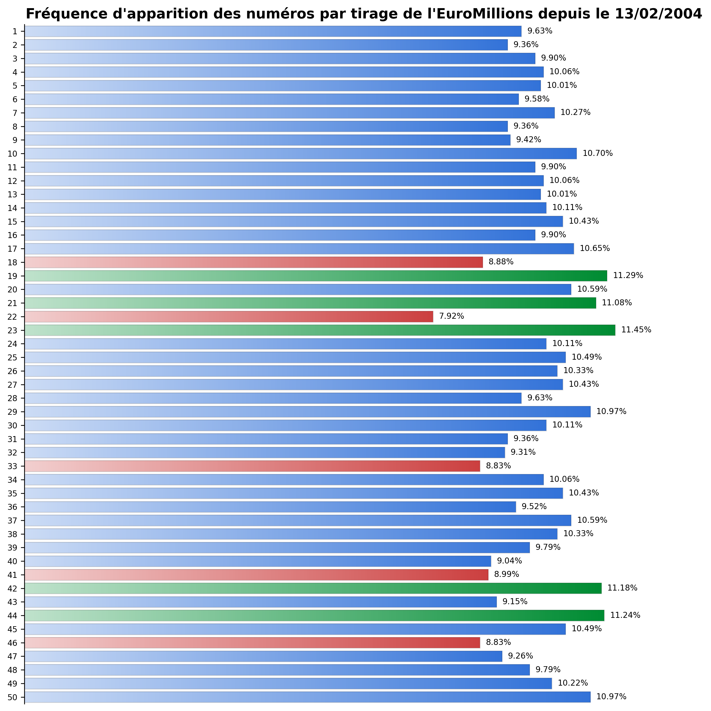
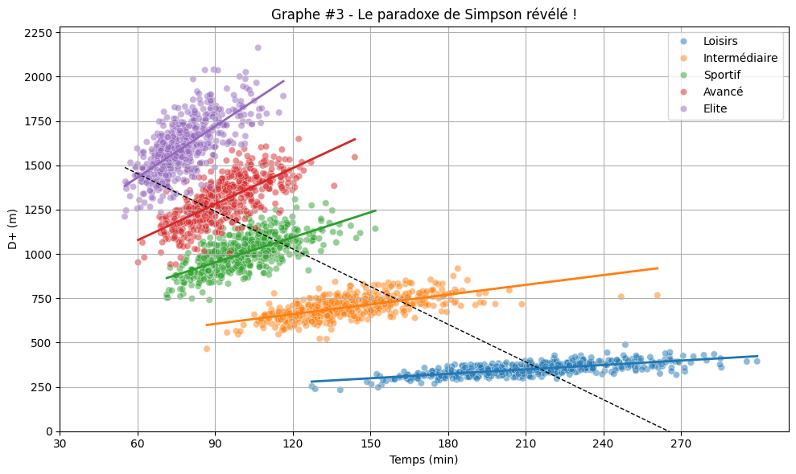
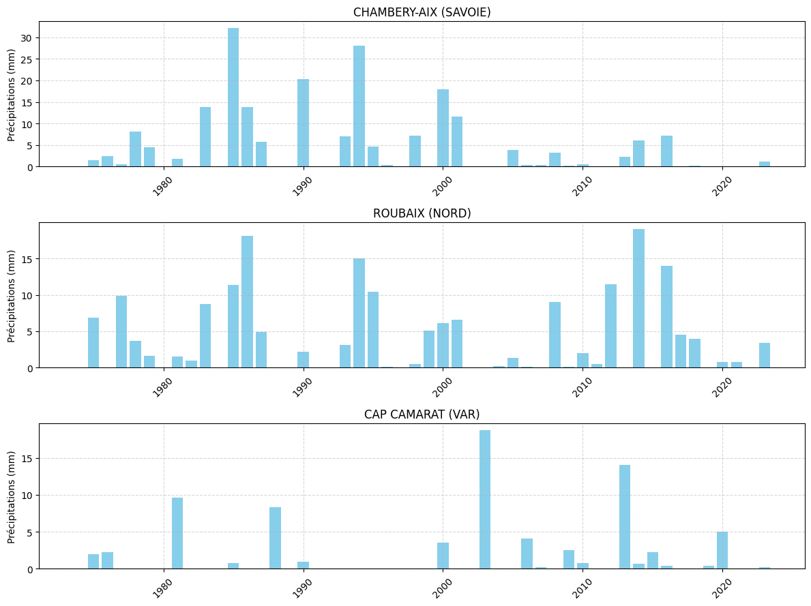

## A propos

Spécialiste de la **valorisation des données**, j’aide les organisations à transformer leurs enjeux métiers en **insights clairs, stratégiques et actionnables**.

Mon expertise couvre **SQL, Python, Power BI**, que je mets au service de la création de **dashboards intuitifs**, de **pipelines robustes** et de stratégies data **orientées résultats**.

Passionné de montagne, j’ai fondé **Mont Blanc Data** : un nom choisi avec soin, car je souhaite être pour mes clients un **guide de leurs données**. Comme en haute montagne, mon rôle est de tracer la voie, sécuriser le chemin et rendre le sommet - vos objectifs - atteignable grâce à une exploitation intelligente de vos données.

Au-delà de la technique, je suis convaincu que **la donnée doit parler à tous**. J’aime raconter les histoires qu’elle porte, vulgariser des concepts complexes et concevoir des analyses **visuelles et inspirantes** qui permettent à chacun – décideur ou passionné – de s’en emparer.

Déjà opérationnel sur des approches en **intelligence artificielle** et **traitement du langage**, je continue à explorer les dernières avancées de la data science pour enrichir mes missions.

**Mon objectif reste inchangé : rendre la donnée claire, accessible et porteuse de valeur.**

---

## Projets sélectionnés en data, analytics & BI

### Scraping d’avis locaux (Aix)

**Contexte** — Collecter et structurer des avis en ligne (cadre local) pour alimenter une future analyse de sentiment / “voice of customer”.  
**Ce que j’ai fait** — Squelette de projet propre (`src/`, `data/`), script d’environnement, fichiers de test, hygiène des données.  
**Compétences clés** — Scraping, structuration de projet, préparation à l’analyse textuelle.  
**Réutilisations pour des clients** — Veille réputation, priorisation des irritants, boucle d’amélioration continue terrain.

 

[Voir le code sur GitHub](https://github.com/montblancdata/aix-reviews-scrapping) • [Voir le post LinkedIn](https://www.linkedin.com/posts/activity-7364174478701965314-6SRg)

---

### EuroMillions — pipeline de nettoyage & dataviz

**Contexte** — À partir d’un fait d’actualité (jackpot record), construire une chaîne **raw → silver → gold** pour analyser les fréquences de tirage.  
**Ce que j’ai fait** — Normalisation des dates/encodages, contrôles de qualité, scripts d’analyse, visuels “social-ready” (format carré).  
**Compétences clés** — Data quality, structuration de datasets, pandas, visualisation claire.  
**Réutilisations pour des clients** — Mises en production rapides de mini-pipelines reproductibles, livrables partageables aux métiers/marketing.

  

  

[Voir le code sur GitHub](https://github.com/montblancdata/analyse-tirage-euromillions) • [Voir le post LinkedIn](https://www.linkedin.com/posts/activity-7320691670239326208-I3ug)

---

### Paradoxe de Simpson

**Contexte** — Cas réaliste de randonnée pour illustrer comment une tendance globale peut s’inverser après segmentation.  
**Ce que j’ai fait** — Simulation de données multi-profils, filtres de cohérence, régressions globales vs par sous-groupes, 3 graphiques clés expliquant le paradoxe.  
**Compétences clés** — numpy/pandas, régression linéaire (scikit-learn), seaborn/matplotlib, pédagogie de l’analyse.  
**Réutilisations pour des clients** — Meilleure lecture d’A/B tests et KPIs agrégés, réduction des faux positifs décisionnels.

  

    

[Voir le code sur GitHub](https://github.com/montblancdata/simpson-paradox) • [Notebook](https://github.com/montblancdata/simpson-paradox/blob/main/simpson-paradox.ipynb) • [Voir le post LinkedIn](https://www.linkedin.com/posts/activity-7318162993681211392--YQx)

---

### Power BI sans regex native : deux solutions

**Contexte** — Extraire des références projets (ex. `PR-YYYY-XXX`) dans Power BI malgré l’absence de regex native.  
**Ce que j’ai fait** — 2 approches complémentaires : script Python (`re`) et script Power Query M compatible Power BI Service.  
**Compétences clés** — Power Query M, Python/regex, design de solutions sous contrainte.  
**Réutilisations pour des clients** — Environnements BI corporate plus flexibles sans ajouter d’outils, rafraîchissements planifiés conservés.

  

  

[Voir le code sur GitHub](https://github.com/montblancdata/regex-pbi)

---

### Analyse de la pluviométrie à Pâques 

**Contexte** — Vérifier l’intuition “il pleut toujours à Pâques” via des données météo ouvertes sur 3 stations françaises.  
**Ce que j’ai fait** — Calcul des dates mobiles de Pâques (Butcher-Meeus), nettoyage/agrégation, comparaisons 1974–1998 vs 1999–2023, visualisations.  
**Compétences clés** — pandas, matplotlib, folium, gestion de dates, EDA et data storytelling.  
**Réutilisations pour des clients** — Décisions saisonnières objectivées (retail, tourisme, événementiel), démystification d’idées reçues.

 

    

[Voir le code sur GitHub](https://github.com/montblancdata/easter-weather) • [Notebook](https://github.com/montblancdata/easter-weather/blob/main/easter-weather.ipynb)

---

### Site portfolio (GitHub Pages / Jekyll)

**Contexte** — Déployer un site épuré pour présenter les projets et livrer des rendus lisibles par les métiers.  
**Ce que j’ai fait** — Customisation d’un template Jekyll minimal, structuration du contenu, assets/SEO simples.  
**Compétences clés** — GitHub Pages, Jekyll, Markdown, design minimal.  
**Réutilisations pour des clients** — Diffusion rapide d’analyses/dashboards et documentation projet publique.

 

[Voir le repo du site](https://github.com/montblancdata/montblancdata.github.io)

---

Page template forked from <a href="https://github.com/evanca/quick-portfolio">evanca</a>

<!-- Remove above link if you don't want to attibute -->
